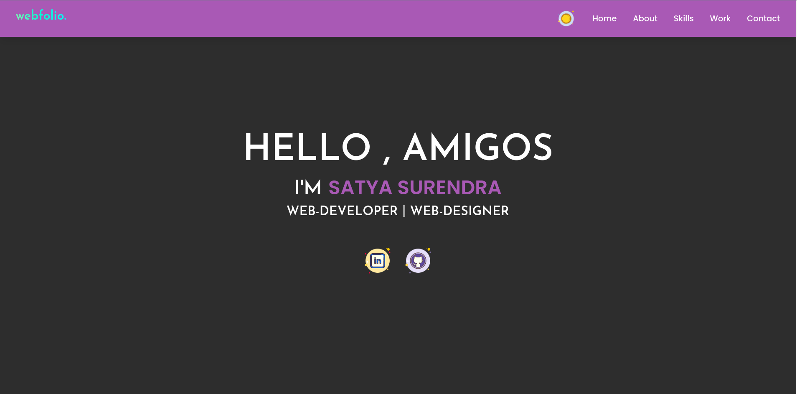

## Webfolio.

[Demo](https://satya-hash.github.io/webfolio/)

### Preview


# Satya Surendra's Webfolio

This is a personal portfolio website built using Vite. The portfolio showcases projects, skills, and provides ways to contact me. It reflects my work as a web developer and designer.

## Features

- **Home**: A brief introduction with links to my social profiles (LinkedIn, GitHub).
- **About**: Information about me as a frontend developer and my experience.
- **Skills**: A list of web technologies and tools I have experience with, including HTML, CSS, JavaScript, React, Firebase, and more.
- **Work**: Detailed descriptions of my key projects, highlighting my contributions and the tech stack used.
- **Contact**: A simple form to reach out via email, with additional contact options like phone and WhatsApp.

## Projects Included

1. **Coding Note**: A blog site for front-end development insights and problem-solving tips.
2. **Shoemine**: An e-commerce platform built with React, MUI, and integrated with Commerce.js for product management and Stripe for payments.
3. **Student Management System**: A web portal for managing student records, developed using React and Firebase.
4. **1Stop**: A major project from my internship focused on HTML, CSS, and JavaScript for UI design.
5. **FitFusion**: A fitness app with workout programs and community features, built with Vite, RapidAPI, and Material UI.

## Technology Stack

- **Vite**: Fast and modern development environment.
- **React**: UI building.
- **Firebase**: Authentication and database management.
- **Tailwind CSS**: For styling.
- **Material UI**: UI component library.
- **Commerce.js**: E-commerce features.
- **Stripe**: Payment processing.

## How to run the project

1. Clone the repository:
    ```bash
    git clone https://github.com/<username>/webfolio.git
    ```

2. Navigate to the project directory:
    ```bash
    cd webfolio
    ```

3. Install dependencies:
    ```bash
    npm install
    ```

4. Run the development server:
    ```bash
    npm run dev
    ```

5. Open the project in your browser at `http://localhost:5176`.

## Deployment

The site can be deployed using any static hosting service that supports Vite, such as Vercel or Netlify.

## License

This project is licensed under the MIT License.
